#### EPR操作
##### 实验前准备物品:
- 01.实验样品
- 02.自带工具
    - 试样杆, 镊子(平头镊子, 塑料镊子), 剪刀, 双面胶, 酒精, 无尘纸, 吹球, 手套
##### EPR操作方法
###### 01.检查:冷却水,温度20℃以下;
###### 02.电源:
- 02.01.直流磁场电源(*标签4*), 打开;
- 02.02.微波电源(*标签3*), 打开;
- 02.03.微波开关机开关(*标签2*), 打开;
- 02.04.直流磁场开关机开关(*标签1*), **不开**;	***imp->此时不开***
###### 03.制样:
- 03.01.酒精清洗样品杆;
- 03.02.样品杆粘双面胶;		    ***imp->确保样品无毛刺***
- 03.03.样品杆粘样品;
- 03.04.样品杆放紧固夹;
- 03.05.放样,避免与腔体接触;	***imp->放样时,样品尽量位于高位(靠近测试腔口)***
- 普通紧固夹:
    - (01)样品尽量位于高位(靠近测试腔口)
    - (02)放样时手握样品杆根部
- 转角紧固夹:
    - (01)选择“最长支撑杆”;
    - (02)保证“支撑杆”与“转角盘”稳定;
    - (03)样品杆“固定”在转角盘上;
    - (04)样品尽量位于高位(靠近转角盘);
###### 04.电脑开机:
- 04.01.刷卡上机;
- 04.02.电脑主机开关;
    - user: *user@xepr*
    - admin: *xepr@linux*
- 04.03.创建文件路径;
    - path: *桌面/Home/DATA/ZhangTianJin/\<xxx\>*
- 04.04.打开软件, 等待进入软件;
###### 05.imp->直流磁场开关机开关, 打开; -> 样品杆下降至测试腔中央;
###### 06.电脑操作:
- 面板位置说明
    - ***Save to Disk***面板, 位于整个窗口***左***侧;
    - ***Store in Memory***面板, 位于整个窗口***左***侧;
    - ***Switch to Processing Mode***面板, 位于整个窗口***左***侧;
    - ***Field Sweep***面板, 位于整个窗口***左***侧;
    - ***Options***面板, 位于整个窗口***左***侧;
    - ***Control Panel for Spectrometer on localhost***面板, 位于整个窗口***下***侧;
    - ***Microwave Bridge Tuning***面板, 位于整个窗口***右***侧;
        - 通过点击下面版Stand by左上方的小方块打开
        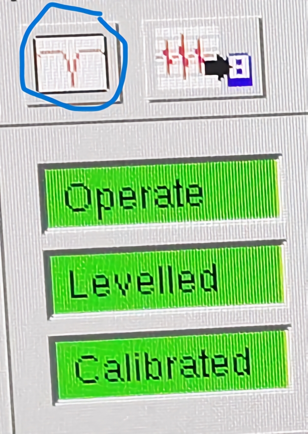
- 06.01.导入测试参数;
    - (01)打开旧测试文件: *File->open->Home/DATA/ZhangTianJin/\<xxx\>*
    - (02)点击:**Copy spectrum parameters to hardware**;
        - 通过点击下面版Stand by右上方的小方块打开
        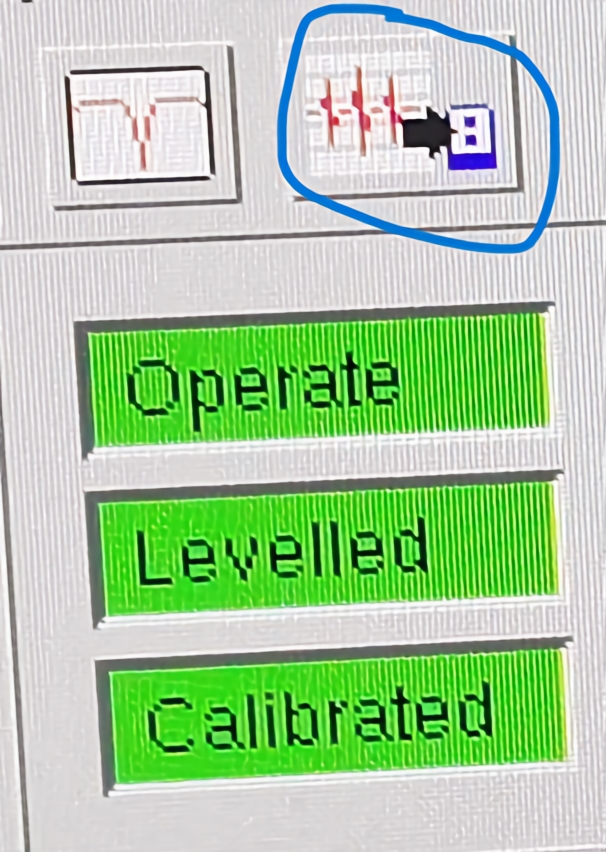
- 06.02.检查测试参数: **Field Sweep**面板
    - *Center Field [G]*: 中心磁场值
    - *Sweep Width [G]*: 扫描磁场宽度
    - *Mode*: 采样模式, 一般选为*Manual*模式
- 06.03.调试仪器参数;
    - (01)自动协调: **Microwave Bridge Tunning**面板
	    - *Phase*栏: 点击*Tune*, 等待中心峰稳定;
	    - *Auto Tuning*栏: 点击*up*, 等待中心峰稳定;
        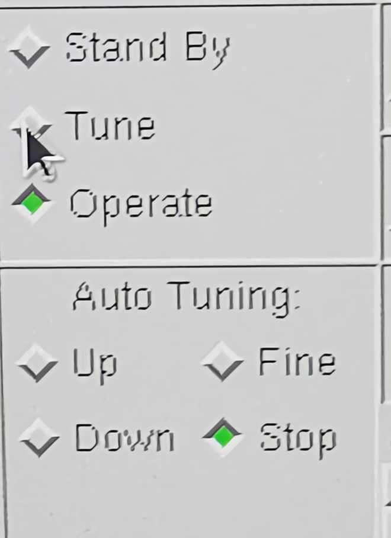
    - (02)手动操作: "Microwave Bridge Tunning"面板
	    - Iris:调节"Diode Current"(整个窗口下方右侧表盘), 示数[190,210uA], 最好为200uA;
        
        
	    - Frequency:调节"Lock Offset"(整个窗口下方右侧表盘), 示数[-10,10%], 最好为0%;
        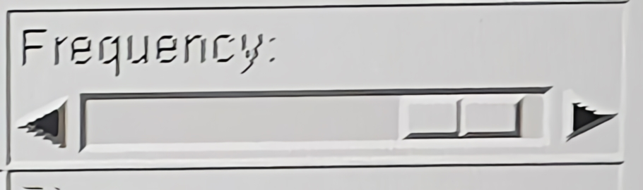
        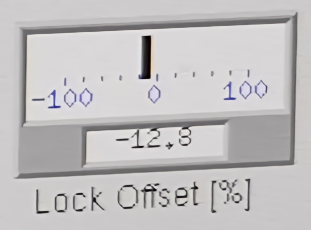
- 06.04.imp->检查参数:
    - (01)"Field Sweep"面板:
	    - *Receiver Gain[dB]*: ***示数[30,60dB], 一般为30dB***;
	    - *Attenuation[dB]*: ***示数[30,60dB], 一般为30dB***;
	    - *Mod. Amp. [G]*: 磁场积分强度, 示数[1,6G];
	    - *Mode*: 采样模式, 一般选为***Manual***模式;
    - (02)"Microwave Bridge Tuning"面板:
	    - 确保"Attenuation[dB]"***示数[30,60dB], 一般为30dB***;
        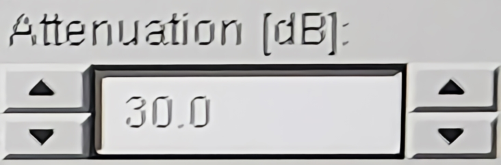
    - (03)"Control Panel for Spectrometer on localhost"面板:
	    - 确保"Operate"为绿色;
	    - 确保"Levelled"为绿色;
	    - 确保"Calibrated"为绿色;
	    - 确保"Field[G]"为绿色;
        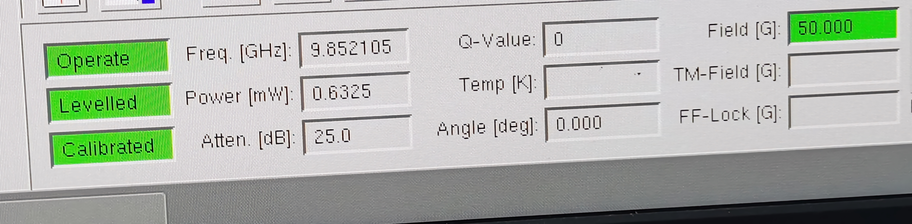
- 06.05.点击"Run"扫描
    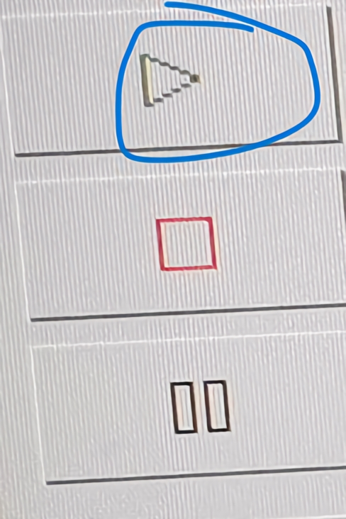
- 06.06.数据保存:
    - (01)**Save to Disk**面板, 确保文件名上下一致, 等待扫描线变红色;
    - (02)菜单栏:**File->export to ASCII**;
###### 07.取样,扫空腔:
- 07.01."Microwave Bridge Tuning"面板:
    - (01)由Operate-> 点击*Tune*,***等待10s*** ->点击*Stand By*,等待1min;
    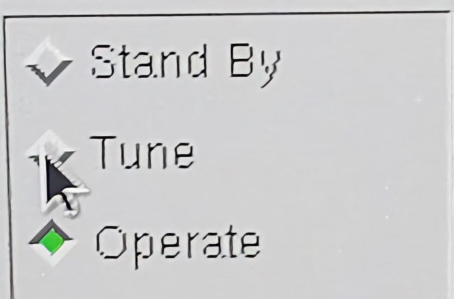
    - (02)等待面板中"Frequency", "Bias", "Signal Phase"选项***全为灰色***;
    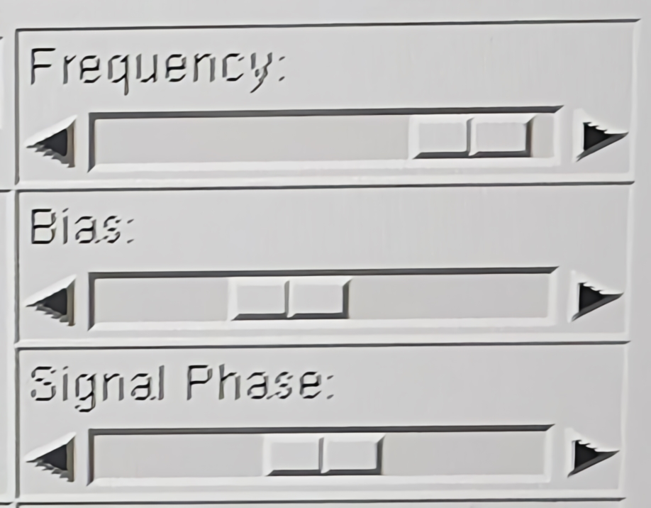
- 07.02.取样, 盖盖子
- 07.03.扫描空腔:"Microwave Bridge Tuning"面板
    - (01)点击Tune, 等待中心峰稳定;
    - (02)点击up, 等待中心峰稳定;
    - (03)检查参数"Attenuation[dB]"***示数[30,60dB],一般为30dB***;
    - (04)确保下端窗口全为绿色;
    - (05)扫描;
- 07.04.保存数据
###### 08.关机
- 08.01.**Microwave Bridge Tuning**面板:
    - (01)由Operate-> 点击*Tune*,***等待10s*** ->点击*Stand By*,等待1min;
    - (02)等待面板中"Frequency", "Bias", "Signal Phase"选项***全为灰色***;
- 08.02.关闭"直流磁场开关机开关(*标签1*)", 观察电流示数[0,0.09A];
- 08.03.关闭软件, 等待软件关闭;
- 08.04.电脑关机(系统关机), 刷卡下机;
- 08.05.关"微波开关机开关(*标签2*)"
- 08.06.关"微波电源(*标签3*)"
- 08.07.关"直流磁场电源(*标签4*)"
- 08.09.刷卡下机
###### 09.收拾桌面,打扫地面,断水断电(电灯),关门;

#### 流程图
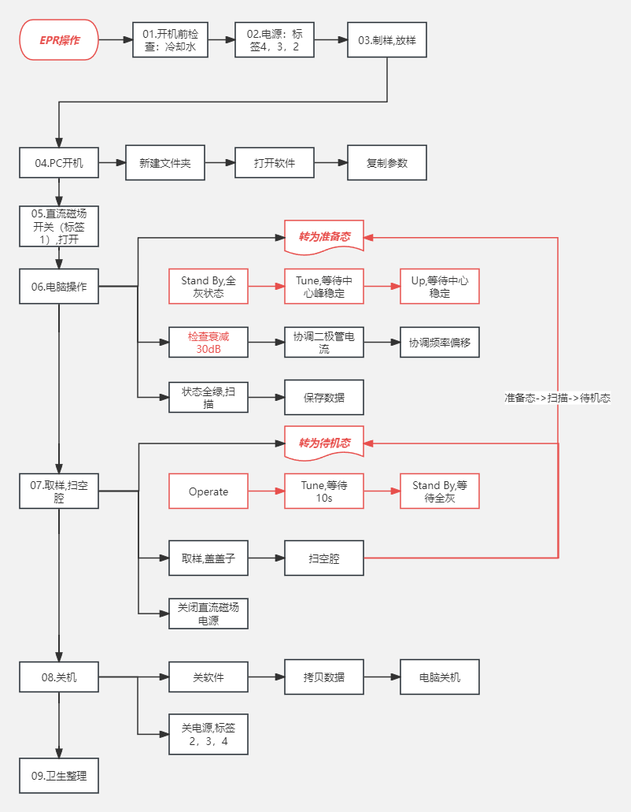